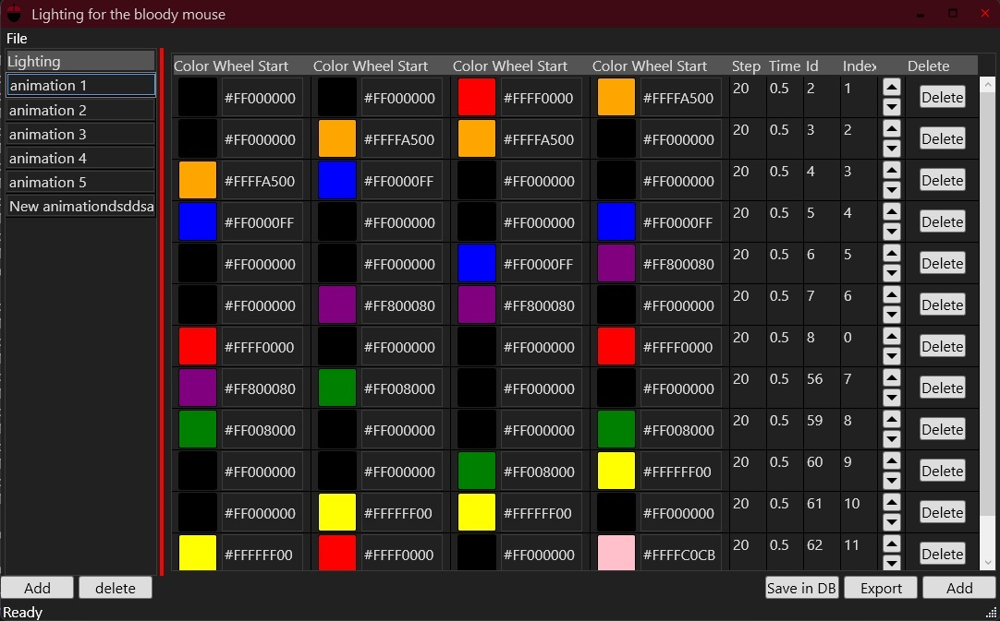

# Applications for creating lighting for Bloody mouse (for now, 2 LEDs). 

 To determine the storage location, click the "Add empty XML" button.
 Restart BloodyWorkShop8.
  **Lighting Settings** => **Lighting Type** set animation
 In **Lighting Effect** find a similar name ( ***English*** ***Standard2_V8MMax***). 
 
 The path to the lighting that BloodyWorkShop8 uses will be:
 C:\Program Files (x86)\BloodyWorkShop8\BloodyWorkShop8\Data\Mouse\ **English** \SLED\ **Standard2_V8MMax**
 After that, you can create new lighting animations and export them.
 For BloodyWorkShop8 to detect new animations, you need to restart BloodyWorkShop8.
 If the animation was edited and added earlier, a restart is not required.
